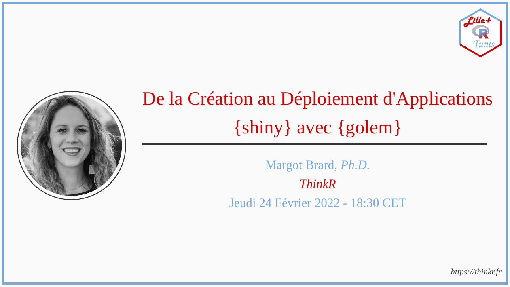

# Collaboration R Lille et Tunis R User Group 

<!-- badges: start -->
<!-- [](LICENSE) -->
<!-- badges: end -->

## Meetups

Veuillez trouver les Meetups passés et futures de la collaboration entre
R Lille et Tunis R User Group.

<table>
<tr>
<td align="center">
<a href="meetups/2022-02-06/materials/README.md"><br/>2022-02-06</a>
</td>
<td align="center">
<a href="meetups/2022-02-24/materials/README.md"><br/>2022-02-24</a>
</td>
</tr>
</table>

## Proposer Un Meetup

Pour proposer un Meetup, il suffit de générer un “Pull Request” (PR)
avec un script R localisé dans le dossier `R`, contenant les
informations comme dans l’exemple ci-dessous (*p.ex.*,
`R/2022-02-24.R`).  
Le PR sera ensuite revue, modifié (au besoin) et enfin validé par
l’équipe organisatrice.  
Pour finir, l’événément sera publié sur le site Meetup.

``` r
# R/2022-02-24.R
social(
  output = here::here("meetups/2022-02-24"),
  rmd_params = list(
    title = "Un Titre", # le titre de votre présentation
    subtitle = "", # un sous-titre optionnel
    author = "Prénom Nom", # votre prénom, nom et éventuellement titre
    institute = "Affiliation", # votre affiliation
    date = "Jeudi 24 Février 2022 - 18:30 CET", # la date de votre présentation
    picture = "https://github.com/Tunis-R-User-Group/Lille-Tunis-Meetups/raw/main/assets/rlille_tunis.svg", # l'url de votre photo
    website = "Votre site web", # l'url de votre site web
    date_short = "2022-02-24", # la date de votre présentation au format YYYY-MM-DD
    abstract = paste(# un résumé de votre présentation
      "Un résumé compatible avec Markdown",
      "(c.-à-d., double espaces pour les sauts de ligne dans le même paragraphe, etc.)",
      sep = "\n  "
    ),
    biography = paste(# une biographie de vous-même
      "Une biographie compatible avec Markdown",
      "(c.-à-d., double espaces pour les sauts de ligne dans le même paragraphe, etc.)",
      sep = "\n  "
    ),
    survey_url = "" # Lien d'inscription au meetup fourni par l'équipe organisatrice
  )
)
```

*Note*: La date proposée dans le PR pourra être modifiée par la suite.
